# aGorA - Autonomous CI/CD Remediation

Original work from the third and final reviews is available at [PACE-Stagecraft](https://github.com/PACE-Stagecraft/).

[Slide deck](../agora/aGorA_Autonomous_CI_CD%20%281%29.pptx)

> When a GitHub Actions pipeline fails, aGorA reads the logs, finds the root cause, writes a
> fix, and presents it for one-click approval - turning a 15-45 minute context-switch into a
> ~45 second review. Built on AWS, Kubernetes, and Amazon Bedrock, with a safety-first design
> where the AI can only *suggest*, never push.


## Architectures
<p align="center">
  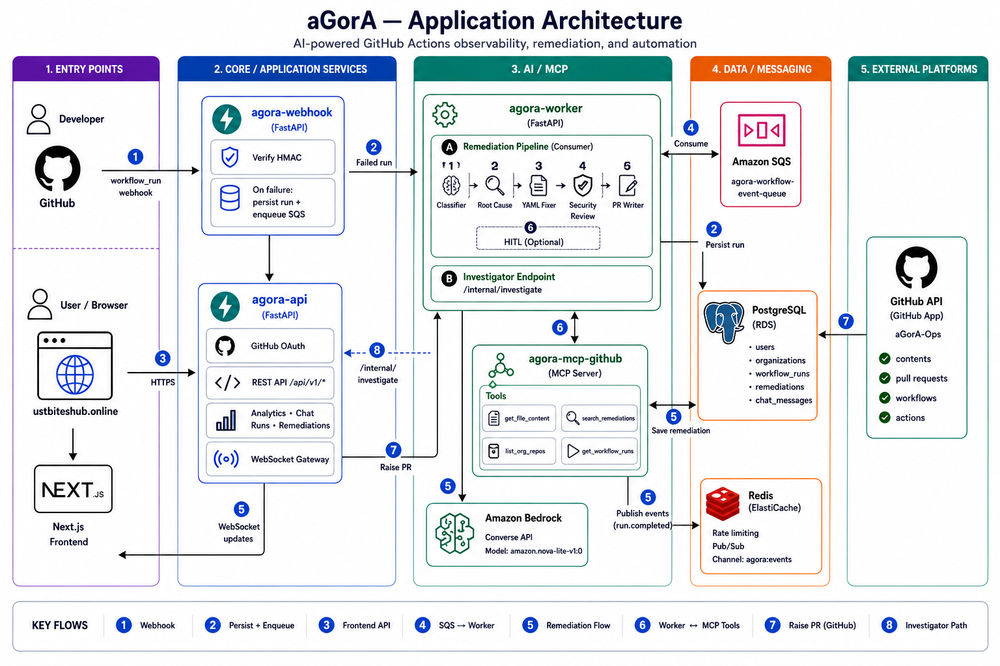
  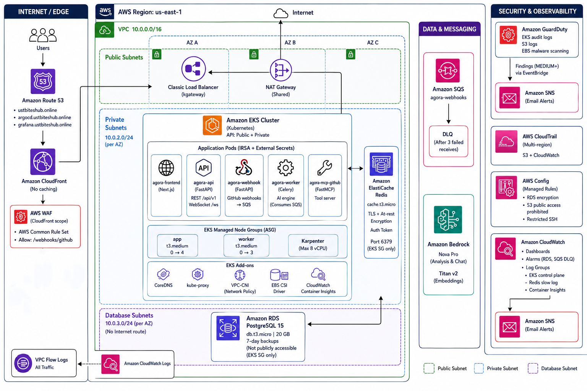
</p>

## UI Screenshots
<p align="center">
  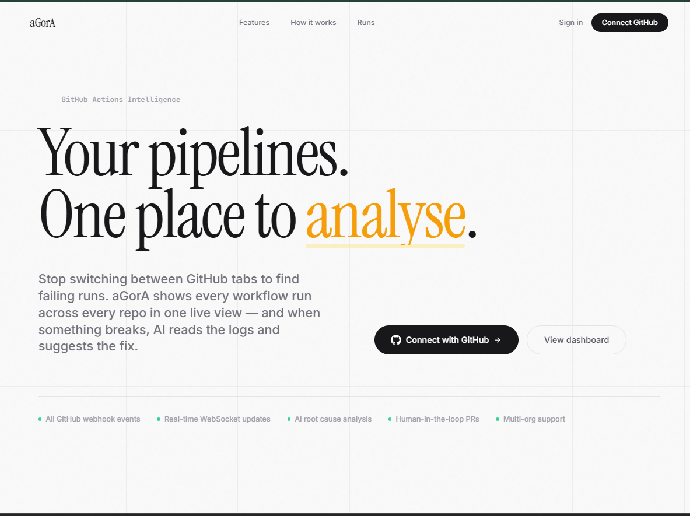
</p>


<p align="center">
  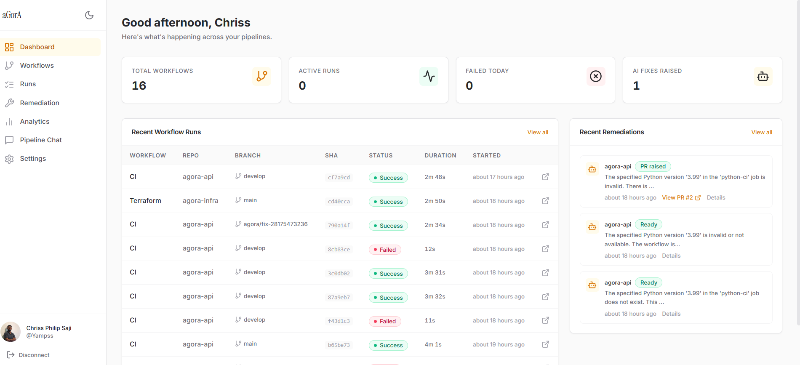
  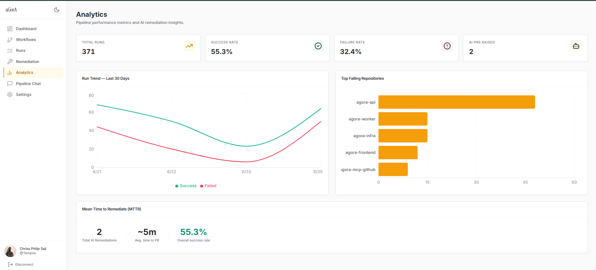
</p>

---

## Table of contents

1. [The problem](#the-problem)
2. [What aGorA does](#what-agora-does)
3. [The end-to-end flow](#the-end-to-end-flow)
4. [The services](#the-services)
5. [The AI system](#the-ai-system)
6. [Authentication & identity](#authentication--identity)
7. [Infrastructure (deep dive)](#infrastructure-deep-dive)
8. [Delivery: CI/CD & GitOps](#delivery-cicd--gitops)
9. [Key engineering decisions](#key-engineering-decisions)
10. [Repositories](#repositories)

---

## The problem

A CI pipeline failure quietly costs more than it looks. A developer gets interrupted, opens the
run, scrolls through thousands of lines of noisy logs, context-switches to the workflow YAML,
reasons about what actually broke, writes a fix, and opens a PR. That's 15-45 minutes of focused
work - and the hard part isn't pattern-matching, it's **reasoning about causation between noisy
log data and structured YAML configuration without breaking developer flow.**

aGorA does the reading and reasoning automatically and hands back a reviewed, ready-to-merge fix.

---

## What aGorA does

- **Detects** failed GitHub Actions runs in real time via webhooks.
- **Analyzes** the failure with a multi-step AI pipeline (classify -> root cause -> fix -> security
  review -> confidence score).
- **Suggests** a corrected workflow YAML, with a plain-English root cause and a confidence score.
- **Lets a human approve** with one click, which opens a real pull request.
- **Learns** from accepted fixes, which become few-shot examples for future similar failures.
- **Answers questions** about your pipelines in natural language ("why does agora-api keep
  failing?", "how many failures yesterday?").

The defining constraint: **the AI is never given write access to your code.** It can only
suggest. A human clicks "Raise PR" to apply anything. Even if a malicious log tried to
manipulate the model via prompt injection, the worst possible outcome is a bad suggestion that a
human rejects - never an auto-committed backdoor.

<p align="center">
  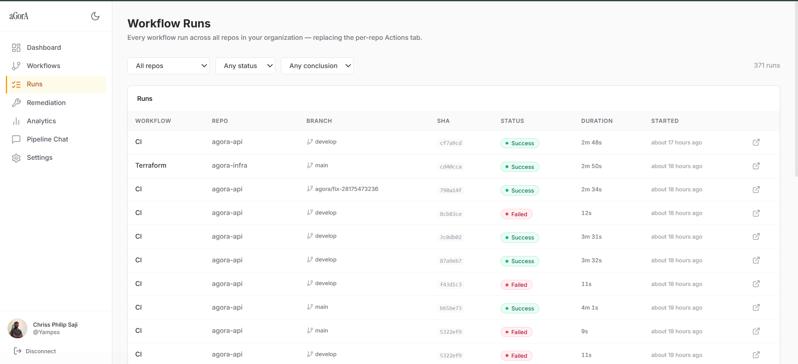
  <br/>
  <sub><i>Every workflow run across all repositories in one place - replacing the per-repo Actions tab.</i></sub>
</p>

---

## The end-to-end flow

```
A pipeline fails on GitHub
   |
   v
GitHub fires a workflow_run webhook
   |
   v
agora-webhook  --  verifies the HMAC signature, drops the event on Amazon SQS,
                   returns HTTP 200 instantly (so GitHub never times out)
   |
   v
Amazon SQS  --  buffers the job; on repeated failure it lands in a dead-letter queue
   |
   v
agora-worker (Celery)  pulls the job and runs the AI pipeline:
     1. Scrub logs        -> strip secrets before the model ever sees them
     2. LangGraph         -> classify -> root_cause -> fix -> security_review -> confidence
     3. Persist + embed   -> save the suggestion to Postgres, embed it into pgvector
   |
   v
Redis pub/sub  ->  agora-api  ->  WebSocket  ->  the dashboard updates live ("fix ready")
   |
   v
A human reviews the fix + confidence score and clicks "Raise PR"
   |
   v
agora-api  mints a scoped GitHub App token and opens the pull request
```

Only **failed** runs trigger AI analysis; successful runs simply update the dashboard's unified
runs view.

<p align="center">
  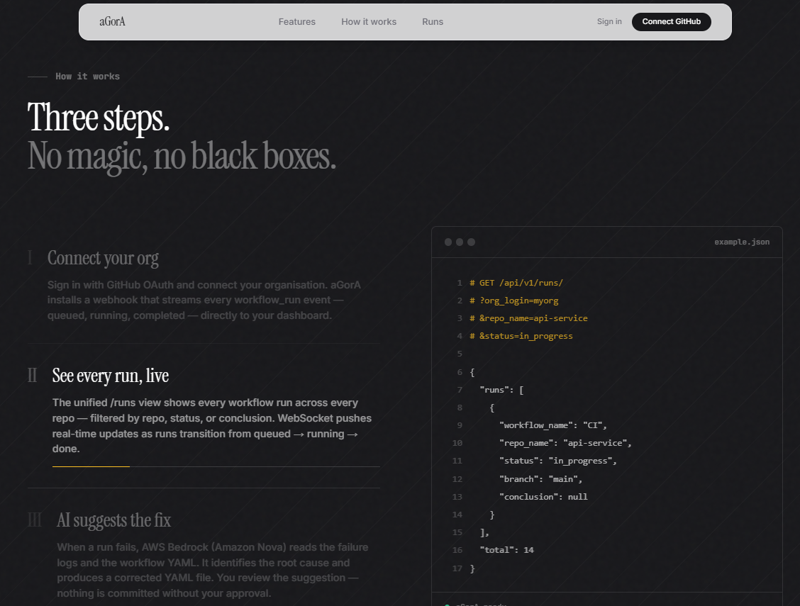
  <br/>
  <sub><i>Three steps, no black boxes: connect your org, watch every run live, and let the AI suggest the fix.</i></sub>
</p>

---

## The services

aGorA is five microservices, split so that slow, expensive AI work never blocks fast,
latency-sensitive request handling.

| Service | Tech | Responsibility |
|---------|------|----------------|
| **agora-frontend** | Next.js | The dashboard - runs, remediations, suggested fixes, Pipeline Chat |
| **agora-api** | FastAPI | REST + WebSocket; user auth; Pipeline Chat; the **only** service that writes to GitHub |
| **agora-webhook** | FastAPI | Receives GitHub events, verifies HMAC, queues them on SQS, returns 200 instantly |
| **agora-worker** | Celery + internal HTTP | The AI brain - remediation pipeline (async) and the chat investigator (sync) |
| **agora-mcp-github** | FastMCP (SSE) | Tool server the AI calls to read GitHub data |

**agora-webhook** is deliberately minimal: it verifies the signature, routes `installation` and
`workflow_run` events to SQS, and returns immediately. It never calls the AI and never touches
GitHub beyond reading the payload - because GitHub disables webhooks that respond slowly, and AI
analysis takes far too long to do inline.

**agora-worker** is dual-mode: it runs Celery tasks consumed from SQS (remediation, org
backfill, embedding backfill, run sync) **and** serves a synchronous internal HTTP endpoint that
powers Pipeline Chat's investigator.

---

## The AI system

Two independent AI flows share one model family (**Amazon Bedrock - Amazon Nova**) and one tool
server (**agora-mcp-github**).

### Flow 1 - Workflow remediation (autonomous)

A **LangGraph state machine** runs once per failed run:

```
classify -> root_cause -> fix -> security_review -> (risk >= 8 ? BLOCKED : pr_writer -> confidence)
```

- **classify** - sorts the failure into one of 9 categories (uses the cheap Nova Micro model).
- **root_cause** - identifies the specific cause; can optionally call read-only GitHub tools for
  more context.
- **fix** - generates corrected YAML with a **3-attempt self-correction loop**: it validates the
  output against a real YAML parser and feeds parser errors back to the model to fix its own
  mistakes.
- **security_review** - scores the proposed fix 0-10 for hardcoded secrets, missing SHA pins,
  overbroad permissions, and dangerous commands. **A score >= 8 hard-blocks the fix.**
- **confidence** - produces a 0-100 score shown in the dashboard so reviewers know how much to
  trust the suggestion.

<p align="center">
  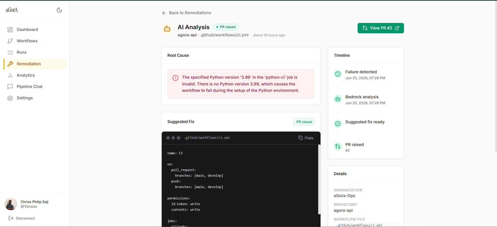
  <br/>
  <sub><i>The AI Analysis view: plain-English root cause, the suggested workflow YAML, and a full timeline (failure detected -> Bedrock analysis -> fix ready -> PR raised).</i></sub>
</p>

### Flow 2 - Pipeline Chat (on-demand)

Ask questions in natural language. A cheap classifier routes each question:

- **Counting / ranking** questions ("how many failures yesterday", "which repo fails most") are
  answered **directly from SQL** - fast, free, exact, no LLM reasoning.
- **"Why / how" questions** go to a bounded **Investigator Agent**: a tool-calling loop (capped
  at 5 rounds) that searches past remediation history and reasons across multiple runs to explain
  patterns and trends.

<p align="center">
  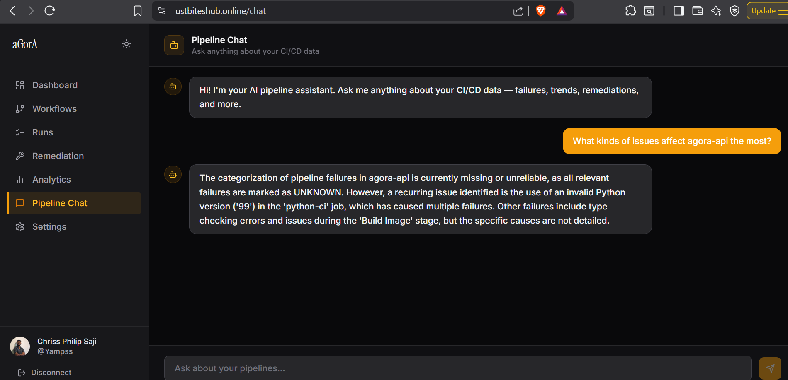
  <br/>
  <sub><i>Pipeline Chat answers natural-language questions about failures, trends, and remediations across the org.</i></sub>
</p>

### Semantic memory (RAG)

Every analyzed remediation is embedded with **Amazon Titan v2** and stored as a **pgvector**
vector inside PostgreSQL (alongside the relational data - no separate vector database). This
powers semantic search in Pipeline Chat and supplies few-shot examples of previously accepted
fixes to improve future suggestions.

### Defense-in-depth AI safety

1. **Regex scrubber (ingestion)** - strips AWS keys, GitHub tokens, DB connection strings, and
   private keys from logs *before* prompt assembly, and truncates to the last 300 lines.
2. **LLM security review (analysis)** - any fix scoring >= 8/10 for risky patterns is blocked and
   discarded.
3. **The human gate (execution)** - the AI pipeline has **zero GitHub write access**. PRs are
   raised exclusively by agora-api, using a scoped GitHub App token, only when a human clicks
   "Raise PR".

<p align="center">
  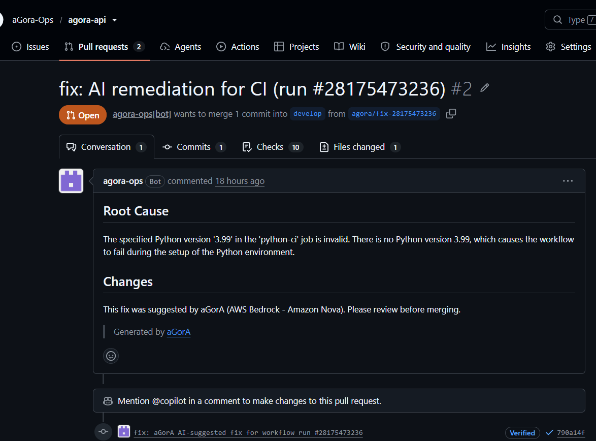
  <br/>
  <sub><i>When a human approves, the fix lands as a real pull request - opened by the <code>agora-ops[bot]</code> with the root cause in the description, on a verified commit.</i></sub>
</p>

---

## Authentication & identity

aGorA uses two completely separate GitHub identities, and the distinction is fundamental.

**User login - GitHub OAuth App.** A user authorizes once; aGorA exchanges the code for a token,
stores it encrypted, and issues its own session (a signed JWT in an httpOnly cookie). This
answers *"who is logged in."*

**Acting on repositories - GitHub App.** Installed per organization by an admin. When the AI
needs to read logs or a human raises a PR, aGorA mints a **short-lived, least-privilege,
per-org installation token**. This answers *"what aGorA is allowed to do."*

Why a separate GitHub App rather than just using the user's token:

- **It works with no human present** - a pipeline failing at 3am still gets analyzed.
- **Least privilege & auditability** - tokens are minted per-org, per-call, short-lived.
- **Resilience** - automation survives the person who installed it leaving the org.

The user OAuth token is only a fallback for raising PRs when the GitHub App isn't configured.

<p align="center">
  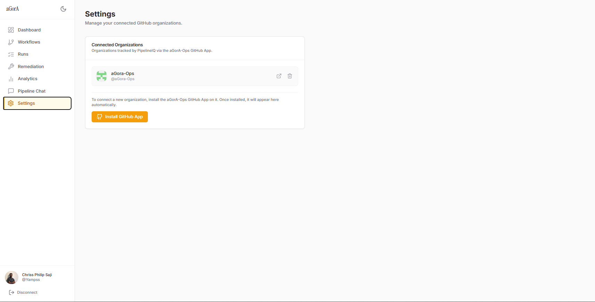
  <br/>
  <sub><i>Organizations connect by installing the aGorA-Ops GitHub App; once installed, they appear here automatically and aGorA starts tracking their runs.</i></sub>
</p>

**No static AWS credentials exist anywhere.** Pods authenticate to AWS via **IRSA** (IAM Roles
for Service Accounts over the EKS OIDC provider) - a Kubernetes ServiceAccount federates to AWS
and assumes a narrowly-scoped IAM role, receiving temporary STS credentials. Configuration
secrets live in AWS Secrets Manager and are synced into pods by the External Secrets Operator,
so nothing sensitive is ever committed to Git.

---

## Infrastructure (deep dive)

Everything runs on **AWS in the `us-east-1` region**, defined entirely in Terraform and delivered
through GitOps. The design goal throughout was **resilient, secure, observable, and
cost-bounded.**

### Network topology

A custom **VPC** (`10.0.0.0/16`) spans **3 Availability Zones**, divided into three subnet tiers
with strictly different trust levels:

- **Public subnets** - host the single shared **NAT Gateway** and the gateway's public load
  balancer. The only tier with a route to the internet gateway.
- **Private subnets** - host the EKS worker nodes and the ElastiCache Redis cluster. They reach
  the internet *outbound only* through the NAT Gateway; nothing reaches them inbound directly.
- **Database subnets** - a fully isolated tier with **no internet route at all**. Only RDS lives
  here, reachable solely from the EKS node security group.

A **single shared NAT Gateway** (rather than one per AZ) keeps cost down. **VPC Flow Logs**
capture all traffic to CloudWatch for auditing.

### Edge & ingress

A request enters at **Amazon Route 53**, which resolves the app domain and the `argocd.` /
`grafana.` subdomains to **Amazon CloudFront**. CloudFront is the single public edge: it
terminates TLS with an ACM certificate and is fronted by **AWS WAF** (the AWS Common Rule Set,
with a carve-out that always allows GitHub's webhook path). CloudFront's origin is the
Kubernetes gateway's load balancer.

CloudFront isn't decoration here - it's load-bearing for security. AWS WAF cannot attach
directly to the gateway's load balancer, so **CloudFront is the architectural path that lets us
put WAF in front of the cluster** while also giving us edge TLS, a stable public domain, and
DDoS protection.

Inside the cluster, **kGateway** (a Gateway API implementation) provisions that load balancer and
routes traffic via `HTTPRoute` resources - a modern, role-oriented alternative to legacy
Kubernetes Ingress with vendor-specific annotations.

### Compute - EKS, node groups, and Karpenter

The workloads run on **Amazon EKS**. Compute is intentionally two-tiered:

- **Managed node groups** (`app` and `worker`, t3.medium, ASG-backed) provide a predictable
  baseline.
- **Karpenter** sits on top as a **groupless, just-in-time autoscaler**. Rather than resizing a
  fixed pool, Karpenter watches for *unschedulable pods*, picks the cheapest instance type that
  bin-packs them, and calls the EC2 API **directly** to launch exactly the node needed - then
  consolidates and terminates nodes when they're underutilized. It's constrained to on-demand
  `t3.medium`/`t3.large` and **hard-capped at 8 vCPUs total** to eliminate runaway-cost risk.

Cluster add-ons include CoreDNS, kube-proxy, VPC-CNI with network policy enforcement, the EBS CSI
driver, and the CloudWatch Container Insights agent.

### Data layer

- **Amazon RDS PostgreSQL 15** - the system of record (users, workflow runs, remediations, chat
  history) **and** the vector store (pgvector `log_embeddings`). It sits in the isolated database
  subnets, is not publicly accessible, and accepts connections only from the EKS node security
  group. Encrypted, with 7-day backups.
- **Amazon ElastiCache Redis** - encryption in transit and at rest with an auth token. Used for
  rate limiting, **pub/sub** (which drives the live WebSocket updates), and as the Celery broker.
  Reachable only from the EKS node security group.

### Asynchronous messaging

**Amazon SQS** decouples ingestion from processing. The webhook publishes failure events; the
worker consumes them. A **dead-letter queue** catches messages that fail three times, and a
CloudWatch alarm fires if anything lands there. IAM is least-privilege: the webhook role can only
*send*, the worker role can only *consume*.

### Container registry

**Amazon ECR** holds five repositories (one per service) with **immutable tags** (a tag can never
be overwritten) and a lifecycle policy keeping the last 20 images.

### Security & observability baseline

- **Amazon GuardDuty** - threat detection across EKS audit logs, S3, and EBS malware scanning.
- **Amazon EventBridge -> Amazon SNS** - GuardDuty findings of medium severity and above are
  routed to an SNS topic that emails alerts. (This security-alerting path is separate from the
  application's SQS/Redis event flow.)
- **AWS CloudTrail** - a multi-region audit trail with log-file validation, delivered to S3 and
  CloudWatch.
- **AWS Config** - managed compliance rules (RDS encryption, S3 public-access prohibited,
  restricted SSH).
- **Amazon CloudWatch** - a dashboard (RDS, SQS depth, EKS CPU/memory), alarms (RDS CPU, RDS
  storage, DLQ depth) wired to SNS, and log groups for the EKS control plane, Container Insights,
  and Redis slow-log.
- **Prometheus + Grafana** (kube-prometheus-stack) run in-cluster for fine-grained metrics and
  dashboards.

<p align="center">
  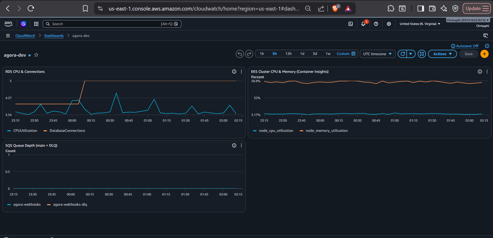
  <br/>
  <sub><i>The <code>agora-dev</code> CloudWatch dashboard: RDS CPU &amp; connections, EKS cluster CPU/memory (Container Insights), and SQS queue depth (main + DLQ).</i></sub>
</p>

<p align="center">
  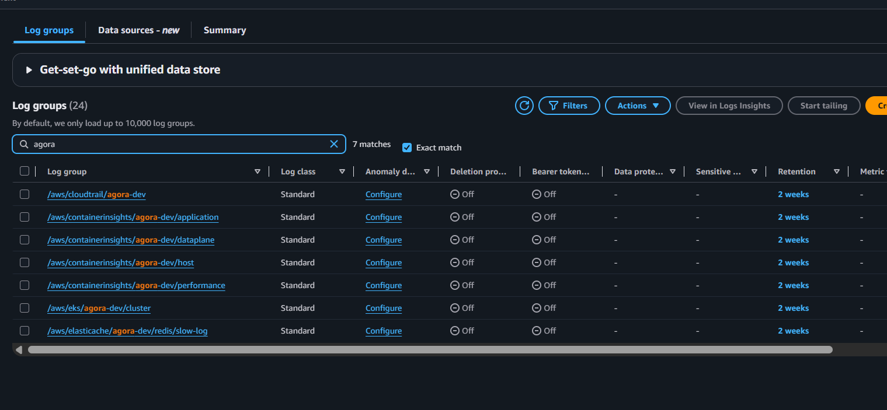
  <br/>
  <sub><i>Centralized log groups: CloudTrail audit, Container Insights (application/dataplane/host/performance), the EKS control plane, and the ElastiCache Redis slow-log.</i></sub>
</p>

### Cross-account isolation

Model inference runs against Amazon Bedrock in a **separate AWS account** that is periodically
wiped. Stateful data (RDS) deliberately stays in the main account; workloads use IRSA to assume a
cross-account role **only during inference**, strictly isolating persistent state from the
inference environment.

### Two-layer Terraform

The infrastructure is split into two Terraform layers, each with its own state:

1. **Base layer** (`aws` provider) - VPC, EKS, RDS, ElastiCache, SQS, IAM, Secrets Manager, the
   security baseline. The raw cloud resources.
2. **Platform layer** (`kubernetes` + `helm` providers) - everything that lives *inside* the
   cluster: kGateway, ArgoCD, Karpenter's runtime, External Secrets Operator, and the monitoring
   stack. It reads the base layer's outputs via remote state.

This split exists because the platform layer needs the cluster from the base layer to already
exist before it can install anything into it.

<p align="center">
  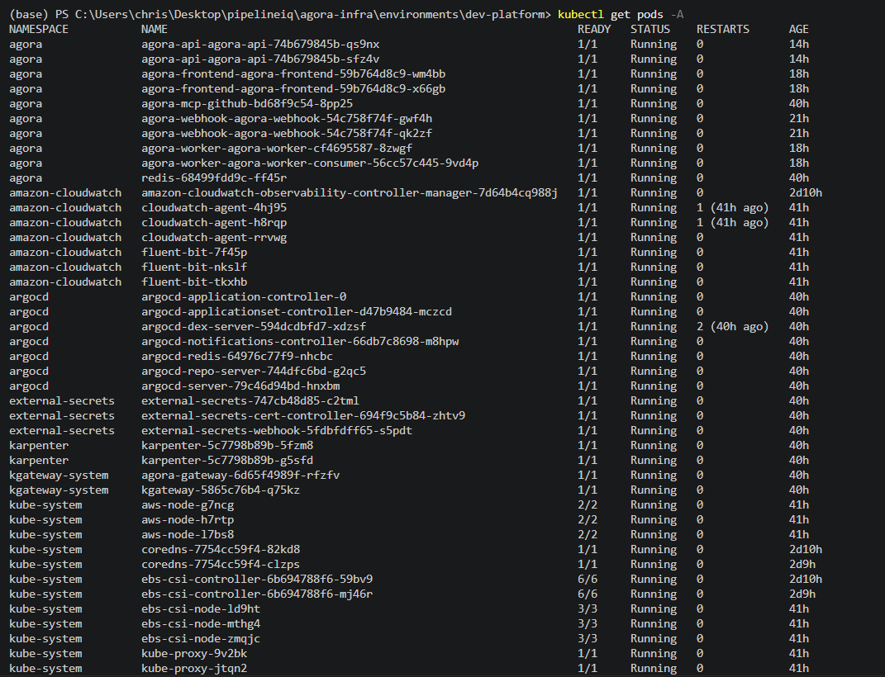
  <br/>
  <sub><i>The full running cluster: application pods in <code>agora</code>, plus ArgoCD, Karpenter, kGateway, External Secrets, and the CloudWatch agents across their namespaces.</i></sub>
</p>

---

## Delivery: CI/CD & GitOps

Application delivery is fully declarative and pull-based:

```
push to `develop`
   -> GitHub Actions:  gitleaks (secret scan) -> pytest -> Docker build -> Trivy (CVE scan, blocks high/critical)
   -> push immutable image to Amazon ECR
   -> bump the image tag in the agora-helm repo (values.dev.yaml)
   -> ArgoCD (running in the cluster) detects the change and auto-syncs the Helm release
```

ArgoCD continuously reconciles the cluster against the Git repository, which is the single
auditable source of truth for all application state. Tracking the branch (rather than a pinned
SHA) means every merge rolls out automatically. Image tags are computed from Git history
(`git describe`) for deterministic, ascending versioning.

<p align="center">
  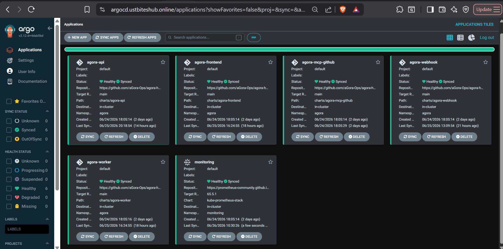
  <br/>
  <sub><i>ArgoCD reconciling every service (frontend, api, worker, webhook, mcp-github) plus monitoring - each synced and healthy from the <code>agora-helm</code> repo.</i></sub>
</p>

---

## Key engineering decisions

| Decision | Rationale |
|----------|-----------|
| **SQS between webhook and worker** | GitHub times out slow webhooks; AI analysis takes ~45s. Queue the job, answer instantly, retry safely, and never lose work. |
| **LangGraph over Bedrock Agents** | Stateless, account-portable, with explicit routing, testable pure functions, and structured error-recovery loops. |
| **pgvector over a managed vector DB** | Zero external dependency; embeddings live alongside relational data with immediate synchronous writes. |
| **CloudFront in front of the gateway** | WAF can't attach to the gateway's load balancer directly; CloudFront is the only path to WAF + edge TLS. |
| **Gateway API / kGateway over Ingress** | Modern, role-oriented routing without legacy vendor-specific annotations. |
| **Karpenter as overflow autoscaler** | Just-in-time, right-sized nodes launched directly via EC2, capped at 8 vCPUs to bound cost. |
| **Read-only AI + human gate** | Eliminates the blast radius of prompt injection - the AI suggests, a human approves. |
| **Cross-account Bedrock** | Isolates persistent state from an inference environment that gets periodically wiped. |

---

## Repositories

| Repo | What it holds |
|------|---------------|
| **agora-api** | FastAPI service - dashboard API, auth, chat, PR creation |
| **agora-worker** | Celery worker - the AI remediation pipeline + chat investigator |
| **agora-webhook** | GitHub webhook receiver |
| **agora-mcp-github** | FastMCP tool server for the AI |
| **agora-frontend** | Next.js dashboard |
| **agora-infra** | Terraform - all AWS infrastructure (two layers) |
| **agora-helm** | Helm charts for the application services (what ArgoCD deploys) |
| **agora-workflows** | Reusable GitHub Actions workflows (build, scan, deploy) |

---

<sub>aGorA demonstrates that applying AI to infrastructure isn't about prompts - it's about
building resilient, secure, and observable pipelines that manage the physical realities of
compute, state, and human safety.</sub>
